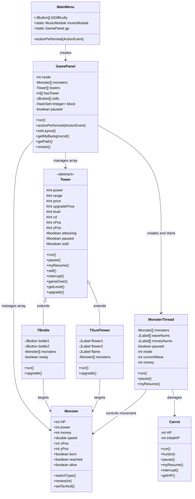

# UML Diagrams - CarrotFantasy Refactoring

## Before Refactoring - Original System Structure

## After Refactoring - New System Structure

```mermaid
classDiagram
    class MainMenu {
        +JButton[] btDifficulty
        +static MusicModule musicModule
        +static GamePanel gp
        +actionPerformed(ActionEvent)
    }

    class GamePanel {
        -int mode
        -Monster[] monsters
        -Tower[] towers
        -GameFacade gameFacade
        +run()
        +actionPerformed(ActionEvent)
        +setGameFacade(GameFacade)
    }

    class GameFacade {
        -GamePanel gamePanel
        -MonsterThread monsterThread
        -GameEntityFactory entityFactory
        -GameStrategyContext strategyContext
        -GameMediator mediator
        +startGame()
        +createTower(int, int, int)
        +upgradeTower(int, int)
        +sellTower(int, int)
        +togglePause()
    }

    class GameEntityFactory {
        <<abstract>>
        +createMonster(int, int)
        +createTower(int, int, int, Monster[], int, Object)
        +createGameElement(String, int)
    }

    class EasyModeFactory {
        +createMonster(int, int)
        +createTower(int, int, int, Monster[], int, Object)
        +createGameElement(String, int)
    }

    class MediumModeFactory {
        +createMonster(int, int)
        +createTower(int, int, int, Monster[], int, Object)
        +createGameElement(String, int)
    }

    class HardModeFactory {
        +createMonster(int, int)
        +createTower(int, int, int, Monster[], int, Object)
        +createGameElement(String, int)
    }

    class GameStrategy {
        <<interface>>
        +executeMonsterMovement(Monster, long, int)
        +isMonsterReachedEnd(Monster)
        +getInitialMonsterHP(int, int)
        +getMonsterSpeed(int)
        +getMonsterMoney(int)
    }

    class EasyModeStrategy {
        +executeMonsterMovement(Monster, long, int)
        +isMonsterReachedEnd(Monster)
        +getInitialMonsterHP(int, int)
        +getMonsterSpeed(int)
        +getMonsterMoney(int)
    }

    class MediumModeStrategy {
        +executeMonsterMovement(Monster, long, int)
        +isMonsterReachedEnd(Monster)
        +getInitialMonsterHP(int, int)
        +getMonsterSpeed(int)
        +getMonsterMoney(int)
    }

    class HardModeStrategy {
        +executeMonsterMovement(Monster, long, int)
        +isMonsterReachedEnd(Monster)
        +getInitialMonsterHP(int, int)
        +getMonsterSpeed(int)
        +getMonsterMoney(int)
    }

    class GameStrategyContext {
        -GameStrategy strategy
        +setStrategy(GameStrategy)
        +moveMonster(Monster, long, int)
        +isMonsterAtEnd(Monster)
    }

    class GameMediator {
        <<interface>>
        +registerGameComponent(GameComponent)
        +notifyGameEvent(GameEvent)
        +removeGameComponent(GameComponent)
    }

    class ConcreteGameMediator {
        -List~GameComponent~ components
        -GameState gameState
        +registerGameComponent(GameComponent)
        +notifyGameEvent(GameEvent, Object)
        -updateGameState(GameEvent, Object)
    }

    class GameComponent {
        <<interface>>
        +receiveGameEvent(GameEvent, Object)
        +getComponentName()
    }

    class TowerGameComponent {
        -Tower tower
        -GameMediator mediator
        +receiveGameEvent(GameEvent, Object)
        +getComponentName()
        +notifyAttack()
        +notifyUpgrade()
        +notifySold()
    }

    class MonsterGameComponent {
        -Monster monster
        -GameMediator mediator
        +receiveGameEvent(GameEvent, Object)
        +getComponentName()
        +notifySpawned()
        +notifyDamaged(int)
        +notifyKilled()
        +notifyReachedEnd()
    }

    class UIGameComponent {
        -String componentName
        -GameMediator mediator
        +receiveGameEvent(GameEvent, Object)
        +getComponentName()
    }

    class GameVisitor {
        <<interface>>
        +visit(Tower)
        +visit(Monster)
        +visit(Carrot)
        +visit(GameElement)
    }

    class SaveGameStateVisitor {
        -StringBuilder gameStateData
        +visit(Tower)
        +visit(Monster)
        +visit(Carrot)
        +visit(GameElement)
        +getGameStateData()
    }

    class StatisticsVisitor {
        -int totalTowerValue
        -int totalMonsterHP
        -int towerCount
        -int aliveMonsterCount
        +visit(Tower)
        +visit(Monster)
        +visit(Carrot)
        +visit(GameElement)
        +printStatistics()
    }

    class RenderVisitor {
        -boolean isPaused
        +visit(Tower)
        +visit(Monster)
        +visit(Carrot)
        +visit(GameElement)
    }

    class GameComponentDecorator {
        <<abstract>>
        -Visitable decoratedComponent
        +accept(GameVisitor)
        +getDecoratedComponent()
    }

    class FireDamageDecorator {
        -int fireDamage
        -int fireDuration
        +accept(GameVisitor)
        +applyFireDamage(Monster)
    }

    class IceSlowDecorator {
        -double slowFactor
        -int slowDuration
        +accept(GameVisitor)
        +applySlowEffect(Monster)
    }

    class ArmorDecorator {
        -int armor
        +accept(GameVisitor)
        +reduceDamage(int)
    }

    class Command {
        <<interface>>
        +execute()
        +undo()
        +getDescription()
    }

    class BuildTowerCommand {
        -GameFacade gameFacade
        -int towerType
        -int x, y
        -Tower builtTower
        +execute()
        +undo()
        +getDescription()
    }

    class UpgradeTowerCommand {
        -GameFacade gameFacade
        -int x, y
        +execute()
        +undo()
        +getDescription()
    }

    class SellTowerCommand {
        -GameFacade gameFacade
        -int x, y
        +execute()
        +undo()
        +getDescription()
    }

    class PauseGameCommand {
        -GameFacade gameFacade
        +execute()
        +undo()
        +getDescription()
    }

    class CommandInvoker {
        -CommandHistory commandHistory
        -GameFacade gameFacade
        +executeCommand(Command)
        +undoLastCommand()
        +redoLastCommand()
        +printCommandHistory()
    }

    class Tower {
        <<abstract>>
        +implements Visitable
        #int power
        #int range
        #int price
        #int upgradePrice
        #int level
        #int cd
        #int xPos
        #int yPos
        #boolean attacking
        #boolean paused
        #boolean sold
        +run()
        +pause()
        +myResume()
        +sell()
        +interrupt()
        +gameOver()
        +getLevel()
        +upgrade()
        +accept(GameVisitor)
    }

    class TBottle {
        -JButton bottle1
        -JButton bottle2
        -Monster[] monsters
        -boolean ready
        +run()
        +upgrade()
        +accept(GameVisitor)
    }

    class TSunFlower {
        -JLabel flower1
        -JLabel flower2
        -JLabel flame
        -Monster[] monsters
        +run()
        +upgrade()
        +accept(GameVisitor)
    }

    class Monster {
        +implements Visitable
        +int HP
        +int power
        +int money
        +double speed
        +int xPos
        +int yPos
        +boolean born
        +boolean reached
        +boolean alive
        +switchType()
        +renew(int)
        +setTexNull()
        +accept(GameVisitor)
    }

    class Carrot {
        +implements Visitable
        -int HP
        -int initialHP
        +run()
        +hurt(int)
        +pause()
        +myResume()
        +interrupt()
        +getHP()
        +accept(GameVisitor)
    }

    class GameElement {
        -String imagePath
        -int x, y, width, height
        +getImagePath()
        +getX()
        +getY()
        +getWidth()
        +getHeight()
    }

    class MonsterThread {
        -Monster[] monsters
        -GameMediator mediator
        -GameStrategyContext strategyContext
        +run()
        +pause()
        +myResume()
    }

    class GameState {
        -int money
        -int currentWave
        -boolean paused
        -boolean gameOver
        -boolean victory
        +getMoney()
        +addMoney(int)
        +deductMoney(int)
        +canAfford(int)
    }

        class GameEvent {
        <<enumeration>>
        MONSTER_SPAWNED
        MONSTER_DAMAGED
        MONSTER_KILLED
        MONSTER_REACHED_END
        TOWER_BUILT
        TOWER_UPGRADED
        TOWER_SOLD
        GAME_PAUSED
        GAME_RESUMED
        GAME_OVER
        VICTORY
        MONEY_CHANGED
    }

    MainMenu --> GamePanel : creates
    GamePanel --> GameFacade : uses
    GameFacade --> GameEntityFactory : creates entities
    GameFacade --> GameStrategyContext : manages strategies
    GameFacade --> GameMediator : coordinates interactions
    GameFacade --> CommandInvoker : executes commands

    GameEntityFactory <|-- EasyModeFactory : implements
    GameEntityFactory <|-- MediumModeFactory : implements
    GameEntityFactory <|-- HardModeFactory : implements

    GameStrategy <|.. EasyModeStrategy : implements
    GameStrategy <|.. MediumModeStrategy : implements
    GameStrategy <|.. HardModeStrategy : implements
    GameStrategyContext --> GameStrategy : uses

    GameMediator <|.. ConcreteGameMediator : implements
    ConcreteGameMediator --> GameState : manages
    ConcreteGameMediator --> GameComponent : coordinates

    GameComponent <|.. TowerGameComponent : implements
    GameComponent <|.. MonsterGameComponent : implements
    GameComponent <|.. UIGameComponent : implements

    GameVisitor <|.. SaveGameStateVisitor : implements
    GameVisitor <|.. StatisticsVisitor : implements
    GameVisitor <|.. RenderVisitor : implements

    GameComponentDecorator <|-- FireDamageDecorator : extends
    GameComponentDecorator <|-- IceSlowDecorator : extends
    GameComponentDecorator <|-- ArmorDecorator : extends

    Command <|.. BuildTowerCommand : implements
    Command <|.. UpgradeTowerCommand : implements
    Command <|.. SellTowerCommand : implements
    Command <|.. PauseGameCommand : implements

    Tower <|-- TBottle : extends
    Tower <|-- TSunFlower : extends

    Monster --> GameComponentDecorator : can be decorated
    Tower --> GameComponentDecorator : can be decorated

    TowerGameComponent --> Tower : wraps
    MonsterGameComponent --> Monster : wraps
    MonsterThread --> GameMediator : uses
    MonsterThread --> GameStrategyContext : uses
```

## Pattern Implementation Summary

### 1. Factory Method Pattern (Creational)
- **Classes**: `GameEntityFactory`, `EasyModeFactory`, `MediumModeFactory`, `HardModeFactory`
- **Purpose**: Centralized creation of game entities based on difficulty mode
- **Benefits**: Reduces code duplication, improves maintainability

### 2. Strategy Pattern (Behavioral)
- **Classes**: `GameStrategy`, `EasyModeStrategy`, `MediumModeStrategy`, `HardModeStrategy`, `GameStrategyContext`
- **Purpose**: Different behavior for monster movement and game mechanics per difficulty
- **Benefits**: Easy to add new strategies, reduces conditional logic

### 3. Facade Pattern (Structural)
- **Classes**: `GameFacade`
- **Purpose**: Simplified interface for complex game operations
- **Benefits**: Reduces coupling, provides high-level interface

### 4. Decorator Pattern (Structural)
- **Classes**: `GameComponentDecorator`, `FireDamageDecorator`, `IceSlowDecorator`, `ArmorDecorator`
- **Purpose**: Dynamically add abilities to game objects
- **Benefits**: Flexible object enhancement, follows Open-Closed Principle

### 5. Mediator Pattern (Behavioral)
- **Classes**: `GameMediator`, `ConcreteGameMediator`, `GameComponent`
- **Purpose**: Coordinate communication between game objects
- **Benefits**: Reduces direct dependencies, improves maintainability

### 6. Visitor Pattern (Additional)
- **Classes**: `GameVisitor`, `SaveGameStateVisitor`, `StatisticsVisitor`, `RenderVisitor`
- **Purpose**: Separate algorithms from object structure
- **Benefits**: Easy to add new operations without modifying classes

### 7. Command Pattern (Additional)
- **Classes**: `Command`, `BuildTowerCommand`, `UpgradeTowerCommand`, `CommandInvoker`
- **Purpose**: Encapsulate game operations as objects
- **Benefits**: Undo/redo functionality, operation queuing

## Key Improvements

1. **Reduced Coupling**: Components communicate through mediator instead of direct references
2. **Improved Extensibility**: New strategies, decorators, and visitors can be added easily
3. **Better Separation of Concerns**: Each pattern handles specific responsibility
4. **Enhanced Maintainability**: Changes to one aspect don't affect others
5. **Flexible Object Creation**: Factory pattern handles complexity of entity creation
6. **Cleaner Code**: Reduced conditional logic and improved readability